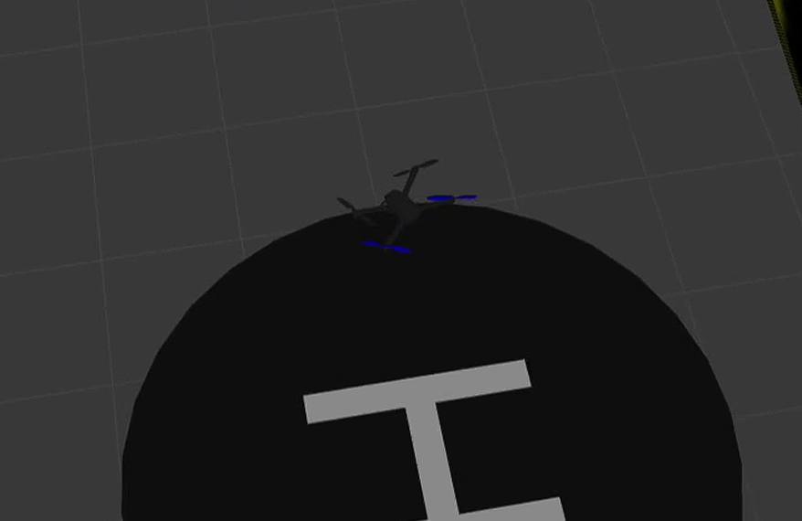

# PX4 Autonomous Landing Submission

A submission for the PX4 PID Tuning & Precision Landing challenge, built using:

- PX4 SITL
- Gazebo Classic
- MAVSDK Python
- Custom `safe_landing.world` helipad environment

This repository documents the PID tuning process and the autonomous flight logic used to take off, navigate to, and land on the helipad.

---

## Demo

[#demo](#demo)

[](demo_video.mp4)

---

## Features

- Two independent autonomous landing implementations:
  - Mission-item based (`mission.py`)
  - `goto_location` based (`landing_script_v2.py`)
- PID-tuned rate and velocity controllers for stable flight
- Continuous position feedback during approach and descent
- Local-to-global coordinate conversion for the helipad target

---

## Challenge Objective

Participants must:

1. Stabilize the drone using PID tuning
2. Achieve stable hover
3. Navigate safely to the helipad location `(5, 3)`
4. Land autonomously on the helipad

---

## Repository Structure

```
AutonomousLanding/
│
├── README.md
├── demo_video.mp4
├── report.pdf
│
├── mission.py
├── landing_script_v2.py
├── pid_tuning.py
│
└── asset/
    └── thumbnail.png
```

> Note: `pid_tuning.py` is included as a reference for the tuning process described in `report.pdf`. The final tuned parameter values have already been applied directly within `mission.py` and `landing_script_v2.py` — it does not need to be run separately to reproduce the demo.

---

## Running the Simulation

Start PX4 SITL with the helipad world:

```
cd PX4-Autopilot
PX4_SITL_WORLD=safe_landing make px4_sitl gazebo-classic
```

In another terminal, run either landing script:

```
python3 mission.py
```

or

```
python3 landing_script_v2.py
```

---

## Landing Workflow

1. Connect to the drone
2. Wait for a valid global position / home position estimate
3. Arm and take off
4. Navigate to the helipad's target location
5. Descend and land autonomously

---

## Report

See `report.pdf` for the full write-up covering the PID tuning process, parameters modified, challenges faced, and the final approach used.
